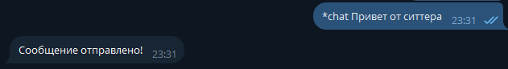
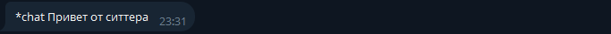
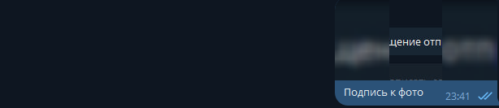

# Pet-Sitters-Services

Простой телеграмм бот для взаимодействия между пользователями сервиса по передержке домашних животных "Pet-Sitters".
Взаимодействие между ситтером и владельцем происходит с помощью перессылки сообщений от имени бота. Бот также позволяет
обмениваться фотоотчетом.

## Команды

- `/start` - инициализация бота, ознакомление с возможностями бота.
- `/help` - команда вызывает справку по боту
- `*chat` - отправка сообщения в формате текста другому пользователю в паре заказа. Для отправки фотоотчета достаточно
  загрузить фотографию и отправить. На данный момент можно пересылать только одну фотографию в одном сообщении.

## Пример работы

1. **Отправка текстового сообщения**
Рассмотрим работу бота на примере команды `*chat`. Один из пользователей вводит команду - `*chat <YOUR MESSAGE>`, в ответ получает сообщение о том, что сообщение отправлено.

Второй пользователь получает сообщение от бота, которое содержит сообщение первого пользователя.

2. **Отправка фотоотчета**

Для отправки фотоотчета пользователю достаточно добавить одну фотографию к сообщению. Причем фотография должна быть
прикреплена именно как изображение, а не документ. При отправке фотографии подпись не отправляется, т.е. другой
пользователь получит только фотографию.

Отправка фотоотчёта первым пользователем:

Получение фотоотчёта вторым пользователем:

## Улучшения

- Добавить меню в виде кнопок, это также позволит сделать вложенное меню
- Добавить уведомления
- Добавить связку с сайтом