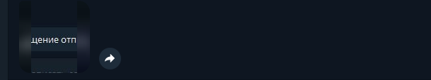

# Pet-Sitters-Services

Простой телеграмм бот для взаимодействия между пользователями сервиса по передержке домашних животных "Pet-Sitters".
Взаимодействие между ситтером и владельцем происходит с помощью перессылки сообщений от имени бота. Бот также позволяет
обмениваться фотоотчетами.

## Установка

Перед началом работы необходимо установить:

- язык Go
- API для работы с Telegram - telegram-bot-api:
  `go get -u github.com/go-telegram-bot-api/telegram-bot-api/v5`

Затем необходимо ввести все необходимые данные в конфигурационный файл в директории - `config/config.go`.

- `TG_TOKEN`
- `PS_TOKEN` - для получения данного токена необходимо создать учетную запись и пройти авторизацию в API PetSitters(см.
  ниже)

## Команды

- `/start` - инициализация бота, ознакомление с возможностями бота. Команда также позволяет записать в хеш-таблицу(мапу)
  телеграм ник в виде ключа и телеграм айди в виде значения.
- `/help` - команда вызывает справку по боту.
- `/menu` - команда вызывает меню под сообщением со справкой. На данный момент особого смысла в ней нет, просто
  показывает функционал.
- `/faq` - команда вызывающая часто задаваемые вопросы.
- `/open` - команда вызывающая встроенную клавиатуру.
- `/close` - команда скрывающая встроенную клавиатуру.
- `*startorder <№ заказа>` - команда для создания чата между пользователями. Обязательна для следующих команд.
- `*chat` - отправка сообщения в формате текста другому пользователю в паре заказа.
- Для отправки фотоотчета достаточно загрузить фотографию и отправить. На данный момент можно пересылать только одну
  фотографию в одном сообщении.
- `*stoporder` - завершение чата после завершения заказа.

## Пример работы

1. Для того чтобы пользоваться функцией отправки текста и фото необходимо ввести команду `*startorder <№ заказа>`, после
   того как бот был активирован командой `/start`.
2. **Отправка текстового сообщения**
   После выполнения команд из первого пункта можно использовать команду `*chat`. Один из пользователей вводит
   команду - `*chat <YOUR MESSAGE>`, в ответ получает сообщение о том, что сообщение отправлено.
   
   Второй пользователь получает сообщение от бота, которое содержит сообщение первого пользователя.
   

3. **Отправка фотоотчета**

   Для отправки фотоотчета пользователю достаточно добавить одну фотографию к сообщению. Причем фотография должна быть
   прикреплена именно как изображение, а не документ. При отправке фотографии подпись не отправляется, т.е. другой
   пользователь получит только фотографию. Каждая фотография отправляется в виде одного сообщения. Т.е. если прикрепить
   несколько фотографий, каждая из них отправиться как отдельное сообщение. Отправка фотоотчета автоматически создаёт
   таймер с напоминанием о следующем фотоотчёте. Соответственно если фотографий несколько - несколько сообщений, а
   значит и несколько таймеров с напоминанием.
   Отправка фотоотчёта первым пользователем:
   
   Получение фотоотчёта вторым пользователем:
   

## Создание учётных записей в API PetSitters

Для работы бота необходима запись о передержке. Бот отсылает запрос по адресу - http://89.223.123.5/keep/keep_crud/.

Разберёмся по шагам.

1. Необходимо создать аккаунт для владельца.
   POST запрос по адресу - http://89.223.123.5/auth/users/.
   ```json
   {   
    "email": "user@example.com",
    "username": "user@example.com",
    "password": "string"
   }
   ```

2. Получить токен, который потом будет использован владельцем.
   POST запрос по адресу - http://89.223.123.5/auth/token/login/
   ```json
   {
    "password": "string",
    "username": "string"
   }
   ```
3. Создаём владельца, используя токен полученный для первого пользователя.
   POST запрос по адресу - http://89.223.123.5/owner/owner_crud/
   ```json  
   {
    "first_name": "string",
    "last_name": "string",
    "patronym": "string",
    "tg_nick": "string",
    "tg_id": "string",
    "phone_num": "string",
    "city": "EVN",
    "address": "string",
    "rating": 0,
    "notes": "string",
    "user": 0
   }
   ```
4. Создаём питомца, используя токен полученный для первого пользователя.
   POST запрос по адресу - http://89.223.123.5/pet/pet_crud/
   ```json
   {
     "species": "CAT",
     "breed": "string",
     "name": "string",
     "gender": "FEM",
     "sterilized": true,
     "birth_year": "2024-06-23",
     "weigth": 0,
     "immunized": true,
     "vet_ppt": true,
     "emergency_contact": "string",
     "diseases": "string",
     "fears": "string",
     "features": "string",
     "outside_lb": "NO",
     "scratch": "string",
     "pulls": "NO",
     "picks": "NO",
     "take": "YES",
     "aggression": "string",
     "no_leash": "YES",
     "dogs_contact": "YES",
     "wash_paws": "BATH",
     "pee_home": "YES",
     "gnaw_home": "NO",
     "walk": "NO"
   }
   ```
6. Повторяя пп.1-2 для создания второго пользователя и получения для него токена.
7. Создаём ситтера, используя токен полученный для второго пользователя. ID для ситтера создаётся автоматически.
   POST запрос по адресу - http://89.223.123.5/sitter/sitter_crud/
   ```json
   {
     "first_name": "string",
     "last_name": "string",
     "patronym": "string",
     "tg_nick": "string",
     "tg_id": "string",
     "phone_num": "string",
     "city": "EVN",
     "address": "string",
     "birth_date": "2024-06-23",
     "social": "string",
     "about": "string",
     "home": "FLAT",
     "animals": "CAT",
     "rating": 0,
     "game": true,
     "activated": true,
     "passport": {
       "pass_num": 9999999999,
       "given_dt": "2024-06-23",
       "given_code": 999999,
       "given_nm": "string",
       "first_nm": "string",
       "second_nm": "string",
       "sur_nm": "string",
       "birth_dt": "2024-06-23",
       "addr_nm": "string"
     }
   }
   ```
8. Создаем передержку от токена первого пользователя. Необходимо указать ID владельца(п.3), питомца(п.4) и ситтера(п.5).
   Все ID можно получить по запросу GET по адресам прописанным в соответствующих пунктах.
   POST запрос по адресу - http://89.223.123.5/keep/keep_crud/

   ```json
   {
     "from_date": "2024-06-23",
     "to_date": "2024-06-23",
     "other_pets": "YES",
     "feed": "1",
     "pick_up": "AM",
     "transfer": "MP",
     "status": "new",
     "owner": 0,
     "pet": 0,
     "sitter": 0
   }
   ```
9. Получаем ID передержки и используем в телеграмм боте.

## Улучшения

- реализовать некоторые переменные в БД